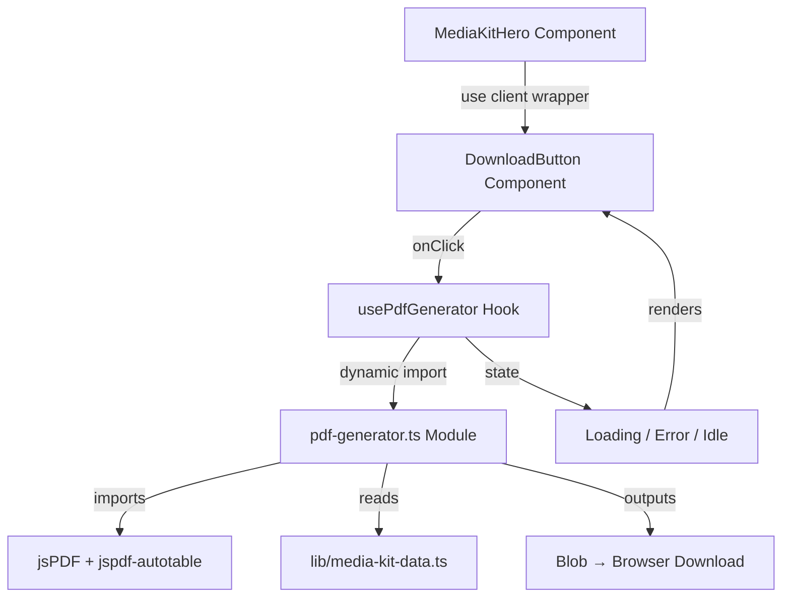

# Design Document: Download Media Kit PDF

## Overview

This feature adds a client-side PDF generation capability to the portfolio page (`/portfolio`). When a user clicks the "Download Media Kit" button in the `MediaKitHero` section, the system generates a branded PDF document containing all media kit data (platform stats, audience demographics, brand collaborations, content examples, and contact info) and triggers a browser download.

The key constraints are:
- **Client-side only**: The site uses `output: 'export'` for static deployment on GitHub Pages — no server-side APIs available.
- **Brand consistency**: The PDF must reflect the pastel aesthetic (pinks, lavenders, mints, rounded elements).
- **Resilience**: Missing or empty data sections should degrade gracefully, not break generation.

### Library Choice: jsPDF + jspdf-autotable

**Decision**: Use [jsPDF](https://github.com/parallax/jsPDF) (v2.x) with the [jspdf-autotable](https://github.com/simonbengtsson/jsPDF-AutoTable) plugin.

**Rationale**:
- **Browser-native**: jsPDF runs entirely client-side with no Node.js dependencies — ideal for static export.
- **Bundle size**: ~95 KB minzipped, acceptable for a feature triggered on demand via dynamic import.
- **Table support**: jspdf-autotable provides structured table/card layouts without manual coordinate math.
- **Maturity**: The most widely-used client-side PDF library in the JS ecosystem with extensive documentation.
- **Font embedding**: Supports adding custom fonts via `.addFont()`, with reliable Helvetica/Arial fallback.

**Alternatives considered**:
- `pdf-lib`: Better for editing existing PDFs; weaker ergonomics for building multi-section documents from scratch.
- `@react-pdf/renderer`: Requires a React rendering pipeline, heavier setup, and doesn't align with the imperative generation flow needed here.
- `pdfmake`: Declarative JSON-based approach is appealing but adds ~300KB to bundle and has more complex font configuration.

## Architecture



### Key Architectural Decisions

1. **Client Component Wrapper**: The portfolio page is a React Server Component. The download button needs client interactivity (`onClick`, state). A new `DownloadMediaKitButton` client component wraps only the button, keeping the rest server-rendered.

2. **Dynamic Import**: jsPDF is ~95KB and only needed on click. Use `import()` to code-split and load the PDF library on demand, avoiding impact on initial page load.

3. **Custom Hook**: `usePdfGenerator` encapsulates the generation lifecycle (idle → loading → success/error), exposing state and a trigger function to the button component.

4. **Pure Generation Module**: `lib/pdf-generator.ts` is a pure function that takes media kit data and returns a Blob. This separation enables unit testing without DOM dependencies.

## Components and Interfaces

### DownloadMediaKitButton (Client Component)

**Path**: `components/media-kit/DownloadMediaKitButton.tsx`

```typescript
"use client";

interface DownloadButtonProps {
  className?: string;
}

// States: 'idle' | 'generating' | 'error'
// Renders the branded gradient pill button with loading/error states
// Calls usePdfGenerator hook on click
```

### usePdfGenerator Hook

**Path**: `lib/hooks/usePdfGenerator.ts`

```typescript
interface UsePdfGeneratorReturn {
  generate: () => Promise<void>;
  state: 'idle' | 'generating' | 'error';
  errorMessage: string | null;
  dismissError: () => void;
}

// Manages generation lifecycle
// Dynamically imports pdf-generator on first call
// Triggers file-saver/download logic on success
// Sets error state on failure with descriptive message
```

### generateMediaKitPdf (Pure Function)

**Path**: `lib/pdf-generator.ts`

```typescript
import type {
  PlatformStat,
  DemographicAge,
  DemographicGender,
  DemographicLocation,
  BrandCollab,
  ContentExample,
  ContactInfo,
} from './media-kit-data';

interface MediaKitPdfInput {
  creatorName: string;
  tagline: string;
  platformStats: PlatformStat[];
  ageBreakdown: DemographicAge[];
  genderDistribution: DemographicGender[];
  topLocations: DemographicLocation[];
  audienceInterests: string[];
  brandCollaborations: BrandCollab[];
  contentExamples: ContentExample[];
  contactInfo: ContactInfo;
}

/**
 * Generates a branded PDF media kit from structured data.
 * Returns a Blob representing the PDF file.
 * Throws on failure (caller handles error display).
 */
export async function generateMediaKitPdf(input: MediaKitPdfInput): Promise<Blob>;
```

### ErrorToast Component

**Path**: `components/media-kit/ErrorToast.tsx`

```typescript
"use client";

interface ErrorToastProps {
  message: string;
  onDismiss: () => void;
  autoHideMs?: number; // defaults to 10000
}

// Fixed-position toast notification
// Dismissible via close button or auto-hides after 10s
// Does not obscure main page content (positioned at bottom-right)
```

## Data Models

### MediaKitPdfInput

The PDF generator function accepts a `MediaKitPdfInput` object aggregating all necessary data. This decouples the generator from the data module's export structure and makes testing straightforward.

```typescript
interface MediaKitPdfInput {
  creatorName: string;          // "saithsfuff"
  tagline: string;              // Max 280 chars, from hero component
  platformStats: PlatformStat[];
  ageBreakdown: DemographicAge[];
  genderDistribution: DemographicGender[];
  topLocations: DemographicLocation[];      // Rendered up to 5
  audienceInterests: string[];               // Rendered up to 10
  brandCollaborations: BrandCollab[];
  contentExamples: ContentExample[];
  contactInfo: ContactInfo;
}
```

### PDF Document Structure

The generated PDF follows this section order (matching the requirements):

| Section | Data Source | Conditional |
|---------|-------------|-------------|
| Introduction | creatorName, tagline, platformStats | Individual fields omitted if missing |
| Platform Statistics | platformStats[] | Entire section omitted if array empty |
| Audience Demographics | ageBreakdown[], genderDistribution[], topLocations[], audienceInterests[] | Subsections omitted if respective array empty |
| Brand Collaborations | brandCollaborations[] | Entire section omitted if array empty |
| Content Examples | contentExamples[] | Entire section omitted if array empty |
| Contact | contactInfo | Always rendered (last section) |

### PDF Configuration Constants

```typescript
const PDF_CONFIG = {
  pageSize: 'letter' as const,        // 8.5 × 11 inches
  orientation: 'portrait' as const,
  margins: { top: 36, right: 36, bottom: 36, left: 36 }, // 0.5 inch = 36pt
  fonts: {
    heading: { name: 'Helvetica', style: 'bold', size: 18 },
    subheading: { name: 'Helvetica', style: 'bold', size: 14 },
    body: { name: 'Helvetica', style: 'normal', size: 11 },
  },
  colors: {
    pink: [244, 180, 195],        // Pastel pink (#F4B4C3)
    lavender: [180, 170, 220],    // Lavender (#B4AADC)
    mint: [170, 220, 200],        // Mint (#AADCC8)
    textDark: [40, 40, 40],       // Near-black body text
    textMuted: [100, 100, 120],   // Muted secondary text
  },
  borderRadius: 8,                 // Minimum 8px for card elements
  maxLocations: 5,
  maxInterests: 10,
  maxTitleLength: 80,
};
```

## Correctness Properties

*A property is a characteristic or behavior that should hold true across all valid executions of a system — essentially, a formal statement about what the system should do. Properties serve as the bridge between human-readable specifications and machine-verifiable correctness guarantees.*

### Property 1: PDF section completeness

*For any* valid `MediaKitPdfInput` where all arrays are non-empty, the generated PDF SHALL contain all six sections (introduction, platform statistics, audience demographics, brand collaborations, content examples, contact) in the specified order.

**Validates: Requirements 2.1, 3.1, 4.1, 5.1, 6.1, 7.1, 8.1**

### Property 2: Graceful omission of empty sections

*For any* `MediaKitPdfInput` where one or more array fields are empty, the PDF generator SHALL produce a valid PDF that omits the corresponding sections entirely while still rendering all sections whose data is non-empty.

**Validates: Requirements 3.4, 4.4, 5.6, 6.3, 7.4**

### Property 3: Platform stats order and field completeness

*For any* non-empty `platformStats` array, the generated PDF SHALL render each platform entry in source-array order, and each entry SHALL include the platform name, follower count, and average views exactly as provided in the input strings.

**Validates: Requirements 4.1, 4.2**

### Property 4: Demographic percentage formatting

*For any* age breakdown entry, gender distribution entry, or location entry with a valid percentage (integer 0–100), the generated PDF SHALL render that entry as the label followed by the percentage value as a whole integer and the "%" symbol.

**Validates: Requirements 5.2, 5.3, 5.4**

### Property 5: Bounded list rendering

*For any* `topLocations` array of length N, the generated PDF SHALL render exactly min(N, 5) location entries in source order. *For any* `audienceInterests` array of length M, the generated PDF SHALL render exactly min(M, 10) interest labels in source order.

**Validates: Requirements 5.4, 5.5**

### Property 6: Brand collaborations order and completeness

*For any* non-empty `brandCollaborations` array, the generated PDF SHALL render each entry in source-array order, and each entry SHALL include the logoPlaceholder, brand name, and category.

**Validates: Requirements 6.1, 6.2**

### Property 7: Content title truncation

*For any* content example with a title string, if the title length exceeds 80 characters, the rendered title in the PDF SHALL be truncated to 80 characters followed by an ellipsis ("…"). If the title length is ≤ 80 characters, it SHALL be rendered in full.

**Validates: Requirements 7.2**

### Property 8: Contact section hyperlinks

*For any* valid `contactInfo` with an email string and a `socialLinks` array, the generated PDF SHALL include the email as a mailto hyperlink and all social link entries as clickable hyperlinks to their URLs, rendered in source-array order.

**Validates: Requirements 8.1, 8.2**

### Property 9: No download on generation failure

*For any* input that causes the PDF generator to throw an error, the system SHALL NOT trigger a file download or produce a Blob that is passed to the download mechanism.

**Validates: Requirements 2.5, 10.4**

### Property 10: Content example ordering preservation

*For any* non-empty `contentExamples` array, the generated PDF SHALL render entries in source-array order, displaying the platform name and view count string as provided for each entry.

**Validates: Requirements 7.1, 7.2**

## Error Handling

| Scenario | Handler | User-Facing Behavior |
|----------|---------|---------------------|
| jsPDF dynamic import fails (network error) | `usePdfGenerator` catch | Error toast: "Unable to load PDF generator. Please check your connection and try again." Button re-enables. |
| Browser lacks Blob/ArrayBuffer API | Pre-check in `usePdfGenerator` | Error toast: "PDF download is not supported in your current browser." Button remains disabled. |
| `generateMediaKitPdf` throws (runtime error) | `usePdfGenerator` catch | Error toast with plain-language failure reason. Button re-enables within 1 second. |
| Download trigger fails (`URL.createObjectURL` error) | `usePdfGenerator` catch | Error toast: "Download could not be initiated. Please try again." No corrupted file is saved. |
| Double-click during generation | `state === 'generating'` guard | Click ignored — button is disabled and shows spinner. |

### Error Toast Behavior
- Positioned fixed at bottom-right, does not obscure main content
- Auto-dismisses after 10 seconds OR user clicks close button
- Accessible: `role="alert"` with `aria-live="assertive"`
- Styled with brand colors (pink border, white background, dark text)

## Testing Strategy

### Unit Tests (Jest + React Testing Library)

Focus on specific examples, edge cases, and component integration:

| Test | What it verifies |
|------|-----------------|
| DownloadMediaKitButton renders with correct label and classes | Req 1.1–1.5 |
| Button shows loading state when clicked | Req 2.3 |
| Button ignores clicks during generation | Req 2.6 |
| Button re-enables after successful generation | Req 2.4 |
| Button re-enables after failed generation | Req 2.5, 11.2 |
| ErrorToast renders message with close button | Req 11.1, 11.3 |
| ErrorToast auto-dismisses after 10 seconds | Req 11.1 |
| Browser compatibility pre-check | Req 10.3 |
| PDF document configured with letter size and correct margins | Req 9.3 |
| Font fallback to Helvetica when custom font unavailable | Req 9.5 |
| Download filename is "saithsfuff-media-kit.pdf" | Req 2.2 |

### Property-Based Tests (fast-check + Jest)

**Library**: [fast-check](https://github.com/dubzzz/fast-check) — the standard property-based testing library for TypeScript/JavaScript.

**Configuration**: Minimum 100 iterations per property test.

Each property test maps to a correctness property from this design:

| Property Test | Design Property | Tag |
|---------------|-----------------|-----|
| All sections present for valid full input | Property 1 | Feature: download-media-kit-pdf, Property 1: PDF section completeness |
| Empty arrays omit sections gracefully | Property 2 | Feature: download-media-kit-pdf, Property 2: Graceful omission of empty sections |
| Platform stats order and completeness | Property 3 | Feature: download-media-kit-pdf, Property 3: Platform stats order and field completeness |
| Percentage formatting for demographics | Property 4 | Feature: download-media-kit-pdf, Property 4: Demographic percentage formatting |
| Location/interest bounded rendering | Property 5 | Feature: download-media-kit-pdf, Property 5: Bounded list rendering |
| Collaborations order and completeness | Property 6 | Feature: download-media-kit-pdf, Property 6: Brand collaborations order and completeness |
| Title truncation at 80 characters | Property 7 | Feature: download-media-kit-pdf, Property 7: Content title truncation |
| Contact hyperlinks present and ordered | Property 8 | Feature: download-media-kit-pdf, Property 8: Contact section hyperlinks |
| No download triggered on error | Property 9 | Feature: download-media-kit-pdf, Property 9: No download on generation failure |
| Content examples order preservation | Property 10 | Feature: download-media-kit-pdf, Property 10: Content example ordering preservation |

### Test File Structure

```
__tests__/
  components/
    media-kit/
      DownloadMediaKitButton.test.tsx   # Unit tests for button component
      ErrorToast.test.tsx                # Unit tests for error toast
  lib/
    pdf-generator.test.ts               # Unit tests for PDF generation
    pdf-generator.property.test.ts      # Property-based tests for PDF content
    hooks/
      usePdfGenerator.test.ts           # Unit tests for hook lifecycle
```

### Testing the PDF Generator

Since jsPDF produces binary PDF output, property tests will:
1. Generate random `MediaKitPdfInput` values using fast-check arbitraries
2. Call `generateMediaKitPdf(input)` to get the PDF Blob
3. Convert the Blob to text and search for expected content strings (jsPDF embeds text as readable strings in the PDF binary)
4. Assert ordering by checking relative positions of text strings in the output

This approach validates content correctness without needing a PDF parser — jsPDF text content is readable in the raw PDF bytes.

### Dependencies to Add

```json
{
  "dependencies": {
    "jspdf": "^2.5.2",
    "jspdf-autotable": "^5.0.2"
  },
  "devDependencies": {
    "fast-check": "^3.22.0"
  }
}
```
