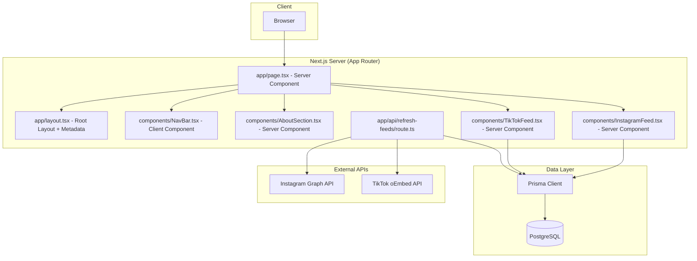

# Design Document: saithsfuff-homepage

## Overview

This design document describes the technical architecture for the saithsfuff.com home page — a whimsical personal landing page for a streamer. The page features a sticky navigation bar, an about section, and embedded social media feeds (Instagram and TikTok), all rendered server-side via Next.js App Router.

**Key Design Decisions:**

1. **Next.js App Router with Server Components** — The page is built using the App Router (`app/` directory) with React Server Components for SSR. Static text (about section, headings) renders on the server; social feed data is fetched server-side then hydrated on the client for interactivity.

2. **Instagram Graph API** — The Instagram Basic Display API was deprecated in December 2024. We use the Instagram Graph API (requires a Business/Creator account) to fetch recent media. A long-lived access token is stored securely and refreshed via a scheduled mechanism.

3. **TikTok oEmbed API** — TikTok does not provide a public feed API for fetching a user's videos programmatically. We use a hybrid approach: video URLs are stored in the database (manually curated or fetched via TikTok's Display API if approved), and thumbnails/links are rendered from that stored data.

4. **Prisma + PostgreSQL for Feed Caching** — Social media posts are cached in the database to avoid rate limits and provide resilience when APIs are unavailable. A background refresh mechanism (API route triggered by a cron job) keeps the cache current.

5. **Tailwind CSS for Whimsical Theming** — Tailwind provides utility-first styling with a custom theme configuration for the pastel color palette, rounded corners, and playful typography.

## Architecture



### Data Flow

1. **Initial Page Load**: Browser requests `/`. Next.js renders the page server-side, querying PostgreSQL via Prisma for cached feed data. The fully rendered HTML (including meta tags) is sent to the browser.

2. **Feed Refresh**: A cron job (e.g., Vercel Cron or external scheduler) calls `POST /api/refresh-feeds` periodically (every 30 minutes). This route fetches fresh data from Instagram Graph API and updates the database cache.

3. **Fallback Handling**: If the database has no feed data or an API call fails during refresh, the feed components display a user-friendly fallback message.

## Components and Interfaces

### Page Components

#### `app/layout.tsx` — Root Layout
- Sets global metadata (title, description, Open Graph tags)
- Loads custom fonts (playful display + sans-serif body)
- Wraps children in the global theme provider

#### `app/page.tsx` — Home Page (Server Component)
- Composes the page sections in order: NavBar → AboutSection → InstagramFeed → TikTokFeed
- Fetches feed data from database via Prisma (server-side, no client fetch needed)
- Passes feed data as props to feed components

#### `components/NavBar.tsx` — Navigation Bar (Client Component)
- Sticky positioning at viewport top
- Displays clickable logo linking to `/`
- Responsive: full nav links on desktop, hamburger menu on mobile (<768px)
- Uses `"use client"` directive for mobile menu toggle state

#### `components/AboutSection.tsx` — About Section (Server Component)
- Renders heading + bio paragraph
- Purely presentational, no interactivity needed
- Applies whimsical typography and decorative accents

#### `components/InstagramFeed.tsx` — Instagram Feed (Server Component)
- Receives array of Instagram posts as props
- Renders "Follow on Instagram" heading
- Displays responsive grid of post images (1 col mobile, 2-3 cols desktop)
- Each image links to original post (opens in new tab)
- Shows "Visit profile" link to Instagram profile
- Shows fallback message if posts array is empty

#### `components/TikTokFeed.tsx` — TikTok Feed (Server Component)
- Receives array of TikTok videos as props
- Renders "Follow on TikTok" heading
- Displays responsive grid of video thumbnails (1 col mobile, 2-3 cols desktop)
- Each thumbnail links to original video (opens in new tab)
- Shows "Visit channel" link to TikTok channel
- Shows fallback message if videos array is empty

### API Routes

#### `app/api/refresh-feeds/route.ts`
```typescript
interface RefreshResponse {
  success: boolean;
  instagramCount: number;
  tiktokCount: number;
  errors: string[];
}

// POST /api/refresh-feeds
// Protected by API key in Authorization header
// Fetches latest posts from Instagram Graph API
// Updates database cache
// Returns count of refreshed items
```

### Service Layer

#### `lib/instagram.ts`
```typescript
interface InstagramMedia {
  id: string;
  mediaType: "IMAGE" | "VIDEO" | "CAROUSEL_ALBUM";
  mediaUrl: string;
  thumbnailUrl?: string;
  permalink: string;
  caption?: string;
  timestamp: string;
}

// fetchInstagramMedia(accessToken: string, limit?: number): Promise<InstagramMedia[]>
// Calls GET /me/media?fields=id,media_type,media_url,thumbnail_url,permalink,caption,timestamp
// Returns parsed media array
```

#### `lib/tiktok.ts`
```typescript
interface TikTokVideo {
  id: string;
  title: string;
  thumbnailUrl: string;
  videoUrl: string;
  permalink: string;
  createdAt: string;
}

// fetchTikTokOEmbed(videoUrl: string): Promise<TikTokOEmbedResponse>
// Calls TikTok oEmbed endpoint for thumbnail/title data
```

#### `lib/feeds.ts`
```typescript
// getInstagramPosts(): Promise<InstagramPost[]>
// Queries database for cached Instagram posts, ordered by timestamp desc

// getTikTokVideos(): Promise<TikTokVideo[]>
// Queries database for cached TikTok videos, ordered by creation date desc

// refreshInstagramFeed(): Promise<number>
// Fetches from API and upserts into database, returns count

// refreshTikTokFeed(): Promise<number>
// Fetches from stored URLs via oEmbed and upserts into database, returns count
```

## Data Models

### Prisma Schema

```prisma
model InstagramPost {
  id          String   @id
  mediaType   String   @map("media_type")
  mediaUrl    String   @map("media_url")
  thumbnailUrl String? @map("thumbnail_url")
  permalink   String
  caption     String?
  postedAt    DateTime @map("posted_at")
  cachedAt    DateTime @default(now()) @map("cached_at")
  isActive    Boolean  @default(true) @map("is_active")

  @@map("instagram_posts")
}

model TikTokVideo {
  id           String   @id
  title        String
  thumbnailUrl String   @map("thumbnail_url")
  videoUrl     String   @map("video_url")
  permalink    String
  createdAt    DateTime @map("created_at")
  cachedAt     DateTime @default(now()) @map("cached_at")
  isActive     Boolean  @default(true) @map("is_active")

  @@map("tiktok_videos")
}

model SiteConfig {
  key   String @id
  value String

  @@map("site_config")
}
```

### Database Notes

- `SiteConfig` stores key-value pairs like the Instagram access token (encrypted), refresh timestamps, and about section content (allowing CMS-like updates without redeployment).
- `isActive` flag allows soft-hiding posts without deleting cached data.
- `cachedAt` tracks when each record was last refreshed, enabling stale-data detection.

## Correctness Properties

*A property is a characteristic or behavior that should hold true across all valid executions of a system — essentially, a formal statement about what the system should do. Properties serve as the bridge between human-readable specifications and machine-verifiable correctness guarantees.*

### Property 1: Feed grid renders exactly one item per input entry

*For any* non-empty array of feed items (Instagram posts or TikTok videos), the feed rendering logic SHALL produce exactly as many grid item elements as there are entries in the input array — no more, no fewer.

**Validates: Requirements 3.3, 4.3**

### Property 2: Feed items link to their original permalink in a new tab

*For any* feed item (Instagram post or TikTok video) rendered in the grid, the clickable element SHALL have an `href` attribute equal to the item's `permalink` field and a `target` attribute of `"_blank"`.

**Validates: Requirements 3.5, 4.5**

### Property 3: Card elements have minimum border-radius

*For any* card or container element rendered on the home page, the applied CSS border-radius value SHALL be at least 8px.

**Validates: Requirements 5.2**

### Property 4: Theme color pairs meet WCAG contrast ratio

*For any* text-color and background-color pair defined in the theme configuration and used for body text, the computed contrast ratio SHALL be at least 4.5:1.

**Validates: Requirements 5.5**

## Error Handling

### Feed Fetch Failures

| Scenario | Behavior |
|----------|----------|
| Instagram API returns an error during refresh | Log error, keep existing cached data, return partial success response |
| TikTok oEmbed returns an error | Log error, skip that video, continue processing remaining videos |
| Database is empty (no cached posts) | Feed component renders fallback message: "Content temporarily unavailable" |
| API rate limit exceeded | Respect `Retry-After` header, skip refresh cycle, retry on next cron trigger |
| Invalid/expired Instagram access token | Log critical error, surface in refresh response, require manual token rotation |

### Component-Level Fallbacks

- **InstagramFeed**: If `posts` prop is empty or undefined, renders a styled fallback card with message "Our Instagram feed is taking a break — check back soon!" and a direct link to the profile.
- **TikTokFeed**: If `videos` prop is empty or undefined, renders a styled fallback card with message "Our TikTok feed is taking a break — check back soon!" and a direct link to the channel.

### Refresh Route Security

- The `POST /api/refresh-feeds` endpoint is protected by an API key passed in the `Authorization` header.
- Returns 401 for missing/invalid keys.
- Returns 500 with error details (non-sensitive) on internal failures.

## Testing Strategy

### Unit Tests

- **Component rendering**: Verify each component renders expected elements (headings, links, images) given valid props.
- **Fallback states**: Verify fallback messages render when feed data is empty/undefined.
- **NavBar responsive behavior**: Verify hamburger menu renders at mobile breakpoint.
- **Metadata**: Verify layout exports correct meta tags.
- **Service layer**: Test `getInstagramPosts()` and `getTikTokVideos()` return correctly shaped data from mocked Prisma.

### Property-Based Tests

Property-based testing applies to the feed rendering logic and theme configuration validation. We use **fast-check** as the PBT library for TypeScript/React.

**Configuration:**
- Minimum 100 iterations per property test
- Each test references its design document property

**Tests:**

1. **Feature: saithsfuff-homepage, Property 1: Feed grid renders exactly one item per input entry**
   - Generate random arrays of valid InstagramPost/TikTokVideo objects (varying length 1-50)
   - Render the feed component with generated data
   - Assert: number of grid item elements === input array length

2. **Feature: saithsfuff-homepage, Property 2: Feed items link to their original permalink in a new tab**
   - Generate random feed items with random permalink URLs
   - Render the feed component
   - Assert: each rendered item's link has `href === item.permalink` and `target === "_blank"`

3. **Feature: saithsfuff-homepage, Property 3: Card elements have minimum border-radius**
   - Generate random sets of card class names from the theme
   - Resolve each to its CSS value
   - Assert: numeric border-radius value >= 8

4. **Feature: saithsfuff-homepage, Property 4: Theme color pairs meet WCAG contrast ratio**
   - Generate all text/background color combinations from theme config
   - Compute WCAG contrast ratio for each pair
   - Assert: ratio >= 4.5 for all body-text pairs

### Integration Tests

- **SSR verification**: Fetch `/` and assert HTML response contains About section content, meta tags, and feed section headings.
- **Feed refresh endpoint**: Call `POST /api/refresh-feeds` with mocked external APIs, verify database is updated correctly.
- **Responsive layout**: Playwright tests at 320px, 768px, and 1920px viewport widths verifying layout behavior.

### Visual Regression Tests

- Snapshot tests for key components at desktop and mobile breakpoints.
- Ensures whimsical styling and decorative elements remain consistent across changes.

