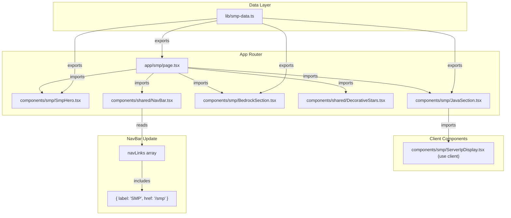

# Design Document: SMP Page

## Overview

The SMP Page is a new route (`/smp`) on saithsfuff.com that advertises the community Minecraft server "saithsfuff SMP." It provides visitors with server details, Java Edition connection info (with a copy-to-clipboard IP display), Bedrock Edition joining instructions, and follows the site's established whimsical pastel aesthetic.

The design mirrors the patterns established by the existing Links page: a React Server Component page shell with a client-side interactive sub-component (the copy-to-clipboard IP display). All user-facing text is sourced from a static data file (`lib/smp-data.ts`), and the page integrates into the site-wide NavBar.

## Architecture



**Key Architectural Decisions:**

1. **Server Component page with a single Client Component leaf.** The page itself (`app/smp/page.tsx`) is a React Server Component. Only `ServerIpDisplay` needs the `"use client"` directive because it uses `useState` for copy-confirmation state and calls the Clipboard API. This minimizes client JS bundle size.

2. **Static data file pattern.** Following `lib/links-data.ts`, all display text lives in `lib/smp-data.ts` with exported TypeScript interfaces. Content updates require zero component changes.

3. **Component folder per page.** Components live in `components/smp/` mirroring the `components/links/` convention.

## Components and Interfaces

### Page Component: `app/smp/page.tsx`

- React Server Component (no `"use client"`)
- Exports a `Metadata` object (`title: "SMP | saithsfuff"`, description referencing the Minecraft server)
- Renders the standard page shell: `DecorativeStars` → `NavBar` → `<main>` → `<footer>`
- Uses `sparkle-divider` elements between sections
- Applies `bg-gradient-whimsical` / `dark:bg-[#1a0e2e]` background

### `components/smp/SmpHero.tsx`

- Server Component
- Renders `<section>` with hero styling (`bg-gradient-hero`, `section-container`)
- Displays the server name as an `<h1>` with `gradient-text`
- Displays a tagline paragraph with `font-body` styling
- Imports hero text from `lib/smp-data.ts`

### `components/smp/JavaSection.tsx`

- Server Component
- Renders `<section>` with an `<h2>` heading
- Wraps content in `whimsical-card`
- Renders `ServerIpDisplay` (client component) for the interactive IP copy element
- Displays optional step-by-step instructions as an ordered list
- Imports section data from `lib/smp-data.ts`

### `components/smp/ServerIpDisplay.tsx`

- **Client Component** (`"use client"`)
- Renders a `<button>` element displaying the server IP address at `text-2xl` (≥1.5× body)
- Implements copy-to-clipboard via `navigator.clipboard.writeText()`
- Manages two states: `idle` and `copied`
- Shows "Click to copy" label in idle state, "Copied!" confirmation in copied state
- Confirmation reverts after 2 seconds (via `setTimeout`)
- Uses `aria-live="polite"` region for screen reader announcement
- Includes `aria-label="Copy server IP address to clipboard"`
- Keyboard-accessible (native `<button>` handles Enter/Space)
- Falls back to selectable `<span>` text if clipboard API is unavailable (detected via `navigator.clipboard` check)

### `components/smp/BedrockSection.tsx`

- Server Component
- Renders `<section>` with an `<h2>` heading
- Wraps instructions in `whimsical-card`
- Displays step-by-step instructions as an ordered list
- Imports section data from `lib/smp-data.ts`

### NavBar Update: `components/shared/NavBar.tsx`

- Add `{ label: "SMP", href: "/smp" }` to the `navLinks` array after the existing entries
- No structural changes needed — the existing map handles rendering in both desktop and mobile layouts

## Data Models

### `lib/smp-data.ts`

```typescript
// =============================================================================
// SMP Page — Static Data
// =============================================================================

// --- Interfaces ---

/** Shape of the hero section content. */
export interface SmpHeroData {
  /** Server name displayed as the h1 heading */
  serverName: string;
  /** Tagline displayed below the heading (max 150 chars) */
  tagline: string;
}

/** Shape of a connection section (Java or Bedrock). */
export interface SmpConnectionSection {
  /** Section heading text */
  title: string;
  /** Step-by-step instructions for connecting */
  steps: [string, ...string[]]; // non-empty tuple — at least one step required
}

/** Top-level SMP page data. */
export interface SmpPageData {
  /** Hero section content */
  hero: SmpHeroData;
  /** The server IP address for Java Edition */
  serverIp: string;
  /** Java Edition connection section */
  javaSection: SmpConnectionSection;
  /** Bedrock Edition connection section */
  bedrockSection: SmpConnectionSection;
}

// --- Data ---

export const smpData: SmpPageData = {
  hero: {
    serverName: "saithsfuff SMP",
    tagline: "A cozy community Minecraft server — come build, explore, and hang out with us!",
  },
  serverIp: "play.saithsfuff.com",
  javaSection: {
    title: "Java Edition",
    steps: [
      "Open Minecraft Java Edition and go to Multiplayer.",
      "Click \"Add Server\" and paste the IP address below.",
      "Join and have fun!",
    ],
  },
  bedrockSection: {
    title: "Bedrock Edition",
    steps: [
      "Open Minecraft Bedrock Edition and go to the Servers tab.",
      "Scroll to the bottom and click \"Add Server\".",
      "Enter the server address and port (coming soon).",
      "Join and have fun!",
    ],
  },
};
```

**Design Rationale:**

- The `[string, ...string[]]` tuple type ensures TypeScript reports an error at build time if `steps` is an empty array.
- A single `SmpPageData` object keeps all content co-located and easily replaceable.
- The structure mirrors `lib/links-data.ts` (interfaces + exported constants).

## Error Handling

### Clipboard API Unavailability

The `ServerIpDisplay` component handles the case where `navigator.clipboard` is undefined (older browsers, insecure contexts):

1. On mount, check `typeof navigator !== 'undefined' && navigator.clipboard`.
2. If **available**: render a `<button>` with copy functionality.
3. If **unavailable**: render a `<span>` with `user-select: all` styling so the IP is easily selectable for manual copy. Hide the "Click to copy" label since the action isn't available.

### State Management for Copy Confirmation

```
idle → (click) → copied → (2s timeout) → idle
```

- If a user clicks again while in `copied` state, the existing timeout is cleared and a new 2-second timer starts.
- The component cleans up any pending timeout on unmount via a `useEffect` cleanup function to prevent memory leaks and state updates on unmounted components.

### Data Validation

- TypeScript strict mode + interface types catch missing/mistyped data at build time.
- The non-empty tuple type `[string, ...string[]]` prevents empty instruction arrays.
- No runtime validation is needed since data is static and compile-time checked.

## Correctness Properties

This feature is primarily UI rendering of static content with a single interactive element (copy-to-clipboard). The following correctness properties can be verified:

### Property 1: Data Completeness

All fields defined in `SmpPageData` are populated with non-empty values. The TypeScript compiler enforces this at build time via strict typing and the non-empty tuple `[string, ...string[]]`.

**Validates: Requirements 5.2, 5.5**

### Property 2: Copy Idempotency

Clicking the Server_IP_Display any number of times always copies the same IP string to the clipboard. The copied value is never mutated or transformed.

**Validates: Requirements 3.4**

### Property 3: State Machine Correctness

The ServerIpDisplay state transitions follow exactly `idle → copied → idle`. There is no third state, no stuck state, and the timeout always returns to idle.

**Validates: Requirements 3.5**

### Property 4: Tagline Length Invariant

`smpData.hero.tagline.length <= 150` — enforced by a unit test since TypeScript cannot express string-length constraints.

**Validates: Requirements 2.2**

### Property 5: DOM Order Invariant

The page always renders DecorativeStars, NavBar, `<main>`, `<footer>` in that exact DOM order regardless of content changes.

**Validates: Requirements 1.3, 6.5**

## Testing Strategy

### Why Property-Based Testing Does NOT Apply

This feature is primarily UI rendering of static content with a single user interaction (copy-to-clipboard). PBT is not appropriate because:

- **No meaningful input variation**: The server IP is a fixed string. Components render static data.
- **UI rendering**: Most acceptance criteria verify specific DOM elements, classes, and text — these are concrete assertions, not universal properties.
- **No pure transformation logic**: There's no parser, serializer, algorithm, or business logic that processes varied inputs.
- **Single interaction path**: The copy button has one input (click) and one output (clipboard write + state change).

### Testing Approach: Example-Based Unit Tests

All tests use **Jest 30** with **React Testing Library**, placed in `__tests__/components/smp/`.

#### Component Tests

| Test File | Covers | Key Assertions |
|-----------|--------|----------------|
| `SmpPage.test.tsx` | `app/smp/page.tsx` | Page renders DecorativeStars, NavBar, main, footer in order; metadata values correct; sparkle-dividers present; background classes applied |
| `SmpHero.test.tsx` | `components/smp/SmpHero.tsx` | h1 contains server name with gradient-text; tagline ≤ 150 chars; font-display on heading; font-body on tagline; dark mode classes |
| `JavaSection.test.tsx` | `components/smp/JavaSection.tsx` | h2 heading present; whimsical-card class; server IP rendered; steps rendered as list items; dark mode classes |
| `ServerIpDisplay.test.tsx` | `components/smp/ServerIpDisplay.tsx` | Displays IP at ≥ text-2xl; "Click to copy" label visible; click calls clipboard.writeText; "Copied!" appears then reverts after 2s; aria-live region announces; keyboard accessible (button element); fallback when clipboard unavailable |
| `BedrockSection.test.tsx` | `components/smp/BedrockSection.tsx` | h2 heading present; whimsical-card class; all steps rendered; dark mode classes |
| `NavBar.test.tsx` | NavBar SMP link | "SMP" link present with href="/smp"; visible in desktop and mobile menu |

#### Test Patterns

- **Mock clipboard API**: `Object.assign(navigator, { clipboard: { writeText: jest.fn() } })`
- **Timer advancement**: Use `jest.useFakeTimers()` and `jest.advanceTimersByTime(2000)` for confirmation timeout
- **Clipboard unavailable**: Delete `navigator.clipboard` before rendering to test fallback
- **DOM order verification**: Use `container.querySelector()` with DOM comparison or `getAllByRole` ordering

#### Data Tests

| Test | Assertion |
|------|-----------|
| `smp-data.test.ts` | `smpData.serverIp` is a non-empty string; `smpData.hero.tagline.length ≤ 150`; all steps arrays are non-empty; all required fields are populated |

#### Integration Considerations

- Build-time verification (`npm run build`) confirms TypeScript types and metadata export correctness.
- The NavBar update is a one-line change testable via existing NavBar rendering tests extended with the SMP link assertion.

