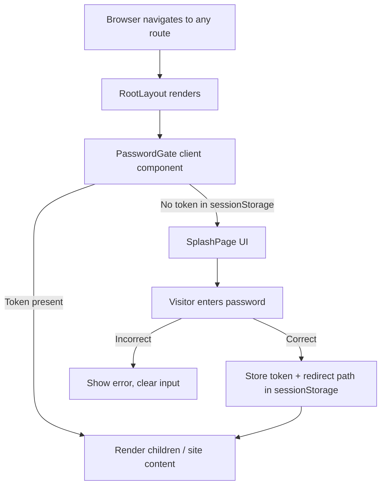

# Design Document: Splash Page

## Overview

The splash page feature introduces a client-side password gate that intercepts all site routes and displays a "coming soon" page until the visitor enters the correct password. Once authenticated, a session token stored in `sessionStorage` grants access to all site content for the duration of the browser tab.

This is a convenience gate (not security-hardened) appropriate for a "coming soon" scenario. The password is embedded at build time via `NEXT_PUBLIC_SITE_PASSWORD` and all logic runs client-side since the project uses `output: 'export'` (static HTML export).

### Key Design Decisions

1. **Layout-level gate**: The password check wraps `{children}` in the root layout rather than being implemented per-page. This ensures all routes are protected with a single code path and no flash of content.
2. **Client Component wrapper**: A `<PasswordGate>` component handles auth state. It renders the splash UI or passes through children depending on sessionStorage state.
3. **No router redirect**: Because Next.js static export doesn't support middleware or server redirects, the gate works by conditionally rendering content. "Redirect after auth" means setting state and rendering the target page, not an HTTP redirect.
4. **Return-to-route via sessionStorage**: The originally requested pathname is stored so that after authentication the visitor sees the page they initially navigated to.

## Architecture



### Component Tree

```
RootLayout (server)
└── PasswordGate (client, wraps children)
    ├── [unauthenticated] → SplashPage
    │   ├── DecorativeStars
    │   ├── Brand heading
    │   └── PasswordForm
    │       ├── <label> + <input type="password">
    │       ├── <button> submit
    │       └── Error message (aria-live)
    └── [authenticated] → {children} (normal site)
```

## Components and Interfaces

### PasswordGate

**Path:** `components/shared/PasswordGate.tsx`
**Directive:** `"use client"`

| Prop | Type | Description |
|------|------|-------------|
| `children` | `React.ReactNode` | The protected site content |

**Responsibilities:**
- On mount, check `sessionStorage` for a valid access token.
- If token is missing, render `<SplashPage>` and capture `window.location.pathname` as the intended route.
- After successful authentication, store the token in sessionStorage and render `{children}`.
- Prevents flash of protected content by rendering `null` (or a minimal loading state) on initial mount until sessionStorage is read.

**Token format:** A simple string value (e.g., `"authenticated"`) stored under the key `"saithsfuff_access_token"`.

### SplashPage

**Path:** `components/splash/SplashPage.tsx`
**Directive:** `"use client"`

| Prop | Type | Description |
|------|------|-------------|
| `onAuthenticated` | `() => void` | Callback invoked when the password is verified |

**Responsibilities:**
- Render the "coming soon" splash UI with brand elements.
- Render the `<PasswordForm>`.
- Include `<DecorativeStars>` background.
- Do NOT render NavBar, footer, or any navigation links.

### PasswordForm

**Path:** `components/splash/PasswordForm.tsx`
**Directive:** `"use client"`

| Prop | Type | Description |
|------|------|-------------|
| `onSuccess` | `() => void` | Callback when password matches |

**Responsibilities:**
- Render a `<form>` with a labeled password input and submit button.
- On submit: trim input, compare against `NEXT_PUBLIC_SITE_PASSWORD` (trimmed).
- If empty submission: show "Password is required" error, do not compare.
- If incorrect: show "Incorrect password" error, clear input field.
- If correct: call `onSuccess()`.
- Announce errors via `aria-live="assertive"` region.
- Support Enter key submission and keyboard-only operation.

### Auth Utility

**Path:** `lib/auth.ts`

```typescript
export const AUTH_STORAGE_KEY = "saithsfuff_access_token";
export const REDIRECT_STORAGE_KEY = "saithsfuff_redirect_path";

export function isAuthenticated(): boolean;
export function setAuthenticated(): void;
export function getRedirectPath(): string;
export function setRedirectPath(path: string): void;
export function clearRedirectPath(): void;
export function validatePassword(input: string): boolean;
```

| Function | Description |
|----------|-------------|
| `isAuthenticated()` | Returns `true` if sessionStorage contains the access token |
| `setAuthenticated()` | Writes the access token to sessionStorage |
| `getRedirectPath()` | Returns the stored redirect path, defaults to `"/"` |
| `setRedirectPath(path)` | Stores the originally requested path |
| `clearRedirectPath()` | Removes the redirect path from storage |
| `validatePassword(input)` | Trims `input` and compares to the trimmed env var (case-sensitive). Returns `false` if env var is unset/empty. |

## Data Models

This feature uses no database or persistent server-side storage. All state lives in the browser's `sessionStorage`:

| Key | Value | Lifetime |
|-----|-------|----------|
| `saithsfuff_access_token` | `"authenticated"` | Browser tab session |
| `saithsfuff_redirect_path` | Pathname string (e.g., `"/portfolio"`) | Cleared after first use post-auth |

### Environment Variable

| Variable | Required | Description |
|----------|----------|-------------|
| `NEXT_PUBLIC_SITE_PASSWORD` | Yes | The password visitors must enter. Embedded at build time. If unset or empty, all access is denied. |


## Correctness Properties

*A property is a characteristic or behavior that should hold true across all valid executions of a system — essentially, a formal statement about what the system should do. Properties serve as the bridge between human-readable specifications and machine-verifiable correctness guarantees.*

### Property 1: Correct password grants access

*For any* non-empty string `p`, if `NEXT_PUBLIC_SITE_PASSWORD` is set to `p` (possibly with surrounding whitespace), then submitting the trimmed value of `p` to the password form SHALL result in `sessionStorage` containing the access token and the `onSuccess` callback being invoked.

**Validates: Requirements 2.3**

### Property 2: Incorrect password is rejected and input is cleared

*For any* string `input` where `input.trim()` does not equal the trimmed value of `NEXT_PUBLIC_SITE_PASSWORD`, submitting `input` to the password form SHALL display an error message, NOT store an access token, and clear the password input field.

**Validates: Requirements 2.4, 2.5**

### Property 3: Redirect preserves originally requested route

*For any* valid site route path (one of `/`, `/links`, `/portfolio`, `/smp`, `/media-kit`), if an unauthenticated visitor navigates to that route and then successfully authenticates, the gate SHALL render the content for that originally requested route rather than a fixed default.

**Validates: Requirements 4.4**

### Property 4: Unset or empty password denies all inputs

*For any* string `input` (including the empty string), if `NEXT_PUBLIC_SITE_PASSWORD` is not set or is an empty string, then `validatePassword(input)` SHALL return `false`.

**Validates: Requirements 5.2**

### Property 5: Password comparison is case-sensitive

*For any* password string `p` containing at least one alphabetic character, if `NEXT_PUBLIC_SITE_PASSWORD` is set to `p`, then submitting a case-altered version of `p` (where at least one character's case differs) SHALL be rejected.

**Validates: Requirements 5.3**

### Property 6: Environment variable whitespace is trimmed

*For any* password string `p` and any leading/trailing whitespace strings `ws1` and `ws2`, if `NEXT_PUBLIC_SITE_PASSWORD` is set to `ws1 + p + ws2`, then submitting `p` (without the surrounding whitespace) SHALL be accepted.

**Validates: Requirements 5.4**

## Error Handling

### Missing Environment Variable

When `NEXT_PUBLIC_SITE_PASSWORD` is not set or is empty:
- `validatePassword()` returns `false` for all inputs.
- The splash page displays permanently with no way to bypass it.
- No error message is shown to the visitor (they simply cannot authenticate).

### Empty Submission

When the visitor submits the form with an empty password field:
- The form shows "Password is required" error immediately.
- No comparison against the env var occurs.
- The input field is not cleared (it's already empty).

### Incorrect Password

When the visitor submits a non-matching password:
- The form shows "Incorrect password" error.
- The input field is cleared.
- No token is stored.
- The visitor can retry immediately with no lockout (convenience gate, not security-hardened).

### Hydration / Initial Mount

- The `PasswordGate` component renders `null` (or a minimal full-screen background matching the splash aesthetic) during the initial mount before `sessionStorage` is accessible.
- This prevents a flash of protected content on first render.
- Once the effect runs and reads storage, the component renders either the splash page or the children.

### sessionStorage Unavailable

In the unlikely event `sessionStorage` is unavailable (e.g., private browsing restrictions in older browsers):
- The gate wraps storage access in a try/catch.
- If reading fails, treat as unauthenticated (show splash page).
- If writing fails after correct password entry, show a generic error and fall through to display the splash page.

## Testing Strategy

### Unit Tests (Jest + React Testing Library)

Unit tests cover specific examples, edge cases, and component rendering:

| Test Area | What's Verified |
|-----------|-----------------|
| SplashPage rendering | "Coming soon" heading present, DecorativeStars present, no NavBar, no footer, no nav links |
| PasswordForm rendering | Password input with type="password" and maxLength=128, submit button present, label associated with input |
| Empty submission | Error "Password is required" shown, no comparison triggered |
| Correct password flow | Token stored in sessionStorage, onSuccess callback called |
| Incorrect password flow | Error message shown, input cleared |
| Enter key submission | Form submits on Enter keypress in password input |
| Accessibility | aria-live="assertive" on error region, label/input association, focusable elements |
| PasswordGate - unauthenticated | Children not rendered, splash page shown |
| PasswordGate - authenticated | Children rendered, splash page not shown |
| Dark mode classes | Appropriate dark: variant classes present on key elements |

### Property-Based Tests (fast-check + Jest)

Property tests verify universal correctness guarantees across many generated inputs. Each property test runs a minimum of 100 iterations.

**Library:** `fast-check` (the standard PBT library for TypeScript/JavaScript)

**Configuration:**
- Minimum 100 iterations per property (`numRuns: 100`)
- Each test tagged with a comment referencing the design property

**Properties to implement:**

| Property | Tag | What's Generated |
|----------|-----|------------------|
| 1: Correct password grants access | `Feature: splash-page, Property 1: Correct password grants access` | Random non-empty strings as password |
| 2: Incorrect password is rejected | `Feature: splash-page, Property 2: Incorrect password is rejected and input is cleared` | Random strings guaranteed to differ from stored password |
| 3: Redirect preserves route | `Feature: splash-page, Property 3: Redirect preserves originally requested route` | Random selection from valid route paths |
| 4: Unset password denies all | `Feature: splash-page, Property 4: Unset or empty password denies all inputs` | Random strings submitted against empty/unset env var |
| 5: Case-sensitive comparison | `Feature: splash-page, Property 5: Password comparison is case-sensitive` | Random strings with alphabetic chars, case-altered variants |
| 6: Whitespace trimming | `Feature: splash-page, Property 6: Environment variable whitespace is trimmed` | Random strings wrapped in random whitespace |

### Integration Tests

Manual verification items not covered by automated tests:
- Responsive layout at 320px, 768px, 1024px, 1440px, 2560px viewport widths
- Focus indicator contrast (WCAG 2.2 Level AA, 3:1 ratio)
- Tab order correctness across password input and submit button
- sessionStorage isolation between tabs (browser-level behavior)
- Visual dark mode appearance

### Test File Structure

```
__tests__/
└── components/
    └── splash/
        ├── SplashPage.test.tsx       # Unit tests for splash page rendering
        ├── PasswordForm.test.tsx      # Unit tests for form behavior
        ├── PasswordGate.test.tsx      # Unit tests for gate logic
        └── auth.property.test.ts     # Property-based tests for validation logic
```
